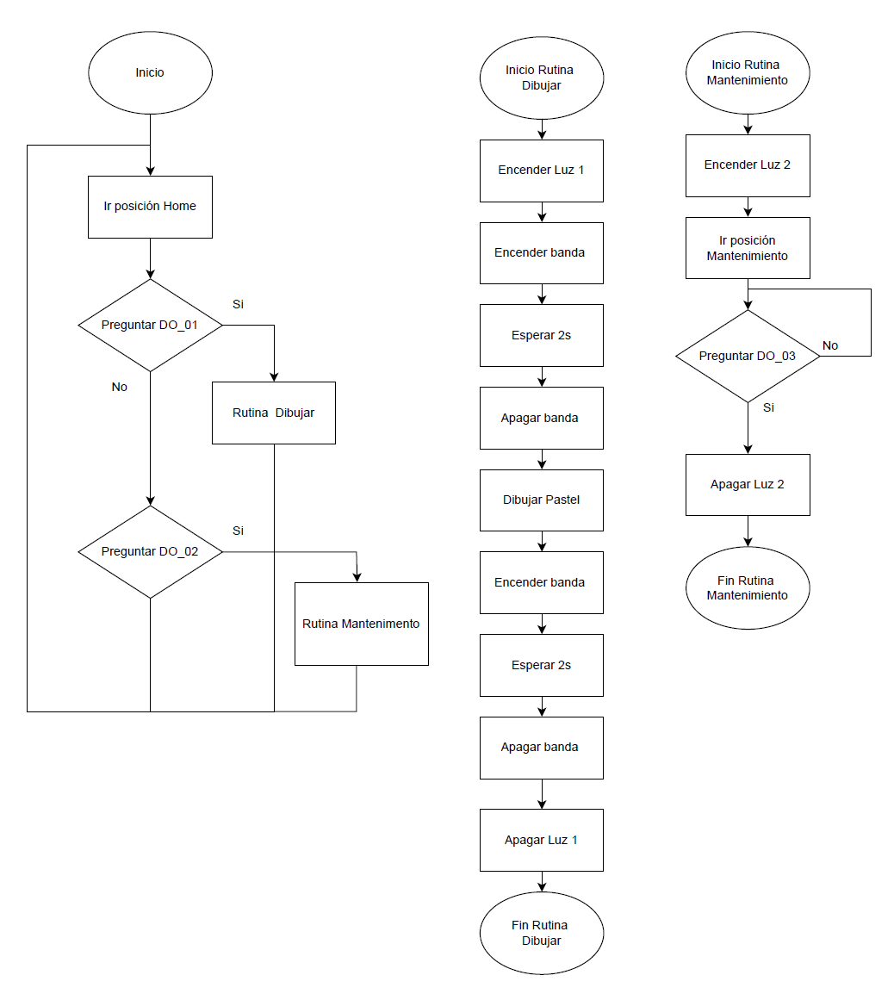

# Laboratorio No. 01 Robotica Industrial - Trayectorias, Entradas y Salidas Digitales
La robótica industrial constituye un pilar fundamental en los procesos de automatización actuales, permitiendo optimizar tareas repetitivas, aumentar la precisión y mejorar la productividad en diversas industrias. En este contexto, el presente laboratorio tuvo como propósito introducir a los estudiantes en el manejo de un robot ABB IRB 140 y su entorno de programación mediante RobotStudio, explorando conceptos esenciales como la definición de trayectorias, la calibración de herramientas, la programación en RAPID y la integración de señales digitales de entrada y salida.

Para lograrlo, se planteó una práctica inspirada en un proceso real de la industria alimentaria: la decoración de tortas. A partir de esta referencia, se desarrollaron trayectorias que simulan la escritura de nombres y figuras sobre una superficie, empleando una herramienta diseñada y calibrada por cada grupo. Asimismo, se trabajó en la configuración de workobjects, la programación de rutinas con condicionales y bucles, y el control de periféricos mediante señales digitales.

De esta manera, el laboratorio permitió afianzar conocimientos teóricos en un entorno práctico, favoreciendo la comprensión de cómo los robots industriales pueden adaptarse a tareas específicas a través de la programación y la correcta integración de hardware y software.

El programa desarrollado en RAPID combina el control de trayectorias del robot con el manejo de señales digitales de entrada y salida, integrando tanto el movimiento del manipulador como la interacción con periféricos.
## Diagrama de Flujo de Trabajo robot ABB

## Secuencia de dibujo y control de la banda transportadora

- Se definen múltiples trayectorias (paths) a través de robtargets que representan letras y decoraciones.
- Cada trayectoria es ejecutada mediante instrucciones MoveL y MoveC, garantizando trazos rectos y curvos según la geometría deseada.
- Durante la ejecución se utilizan salidas digitales para controlar periféricos, específicamente la banda transportadora.
- Al finalizar la escritura, el programa activa una salida digital SET para encender la banda y trasladar el pastel.
- Luego, otra instrucción RESET detiene la banda cuando el transporte termina.

## Modo de mantenimiento
- Se define una rutina que mueve el robot a una posición de mantenimiento (pose segura para instalar o retirar la herramienta).
- Una vez en esta posición, el robot permanece detenido hasta recibir una señal de entrada digital.
- Mientras la entrada no se active, el robot no abandona la pose, garantizando seguridad en el montaje/desmontaje de la herramienta.
- Cuando la señal de entrada se activa, el flujo del programa se reanuda, permitiendo regresar a HOME y continuar con la operación normal.
En conjunto, la solución implementa un sistema híbrido de control de trayectorias y periféricos, cubriendo tanto la automatización del proceso de decorado como la seguridad en el mantenimiento.
## Plano Herramienta
Para evitar problemas con los sitemas coordenados del efector final  con el TCP de la herramienta (Singularidad) se diseño el soporte de marcador con un ángulo de 70°
[Plano Herramienta](./Plan_Herramienta_soporte_marcador.pdf)
## Plano zona de trabajo
Para programar la rutina de funcinamiento es necesario conocer el espacio de trabajo por ello se realiza un plano de dimensiones entre los distintos elementos que interactuaran 
-Banda Transportadora 
-Robot ABB IRB140
-Pastel
[Plano_Planta](https://drive.google.com/drive/folders/1m9bLsUY3h1o9nVy3-tOxG_N4i99i_Ioc?usp=sharing)
## Descripción de las funciones utilizadas
- MoveL – Movimiento lineal cartesiano, usado para dibujar letras y trazos rectos.
- MoveC – Movimiento circular cartesiano, empleado para curvas y trayectorias suaves.
- MoveJ – Movimiento articular, utilizado para cambios rápidos entre posiciones (ej. regreso a HOME o mantenimiento).
- robtarget – Variables constantes con posiciones predefinidas del robot (coordenadas y orientación).
- PROC … ENDPROC – Procedimientos que encapsulan cada trayectoria (Path_10, Path_20, etc.), la rutina de mantenimiento y la secuencia principal.
- SET activa una salida (ej. encender banda transportadora o luz de estado).
- RESET desactiva una salida.  
Revisar código rapid [ Programa RAPID - Module1.mod](./Module1.mod)
## Video Simulación de la rutina robot ABB
[Ver Video Simulación](./Video%20Simulacion.mp4)
## Video de comprobacion en Laboratorio
[Ver Video Implementacion](https://drive.google.com/file/d/1O5KdWd1j4Cgxe9Qc39gbEB7oUv4XNwzi/view?usp=sharing)
